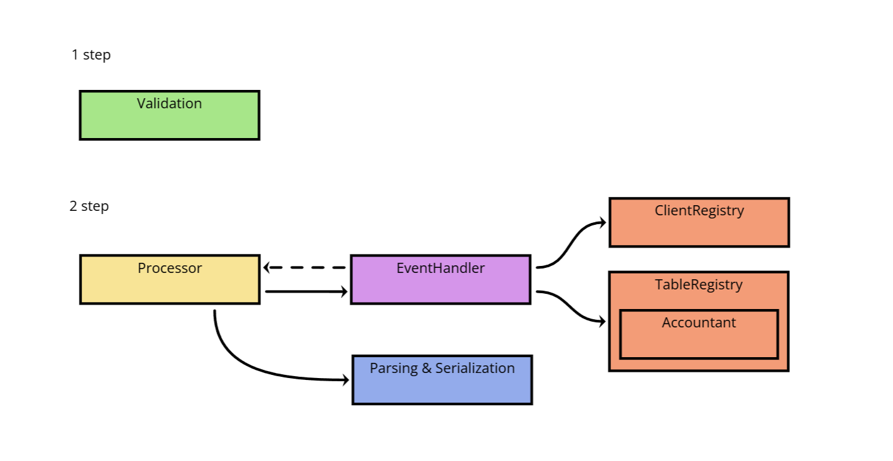

# yadro-computer-club

## Overview



Data validation was implemented through the `ValidationPipeline & ValidationStep` abstraction. 
At each validation step, the correctness of the data is checked using regular expressions.

In general, there was an attempt to create a layered architecture with layers of business and view logics. 
The business logic is implemented through an `EventHandler` that deals with the logical processing of events. 
Interaction with the data is carried out through the `ClientRegistry` and `TableRegistry`. 
The `Accountant` entity responsible for reports generation at the end of each day (during the day it receives information about events related to tables and users). 
The work with input data is implemented through the functions of parsing and serialization. 
These two layers are interconnected within the `Processor` abstraction.

Several tests have been written for validation and processing. The tests are written using the [GoogleTest](https://github.com/google/googletest) framework. 

## Build & Usage

CMake is used to build the project.
The targets we are interested in are `yadro_computer_club` and `run_tests`.

The syntax for using `yadro_computer_club` is as follows
```shell
yadro_computer_club <input>
```
here, `<input>` indicates an input file.
The `run_tests` target can be launched without additional parameters
```shell
run_tests
```

> [!NOTE]
> The project was built on Ubuntu (using make) and on Windows (using the built-in tools of CLion, which, apparently,
> uses ninja under the hood). 