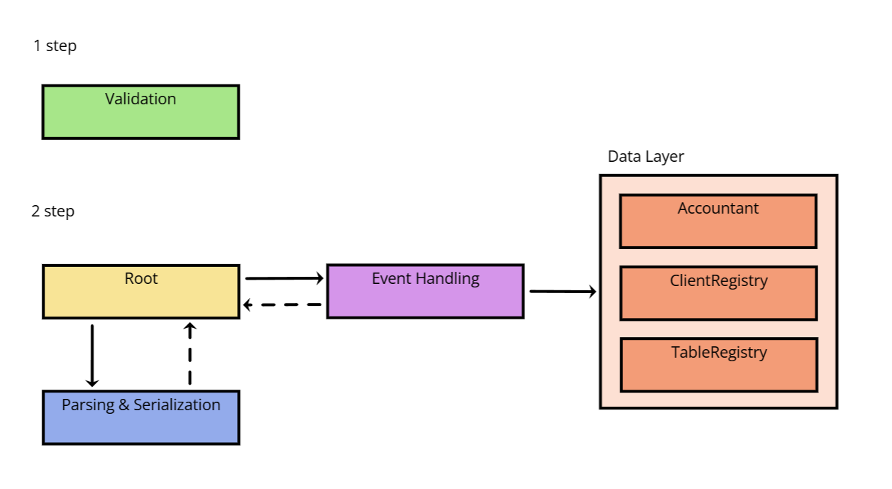

# yadro-computer-club


## Обзор
Данный проект представляет собой решение тестового задания от компании Yadro, в рамках которого был разработан прототип системы для мониторинга работы компьютерного клуба. 
Подробное описание задания доступно в файлах `assets/assignment.docx` или `assets/assignment.pdf`.


## Обзор архитектуры
Архитектура программы построена по принципам слоистой структуры, которая включает в себя слои бизнес-логики, взаимодействия с данными и логики ввода/вывода. 
На следующем изображении представлены зависимости между различными слоями системы:


### Представление событий
В системе события классифицируются на внутренние и внешние, что определяет логику их обработки. 
В коде события реализованы в виде структур, хранящих необходимые данные для обработки.
Регистрация событий осуществляется в файле `events/events.def` с использованием макросов `COMPUTER_CLUB_INTERNAL_EVENT(Id, Name)` и `COMPUTER_CLUB_EXTERNAL_EVENT(Id, Name)`.
Эти макросы позволяют ассоциировать идентификатор события с его названием.

### Слой бизнес-логики
Бизнес-логика реализована через функции `Handle##EventName##Event`, которые являются конечными точками обработки событий. 
Этот слой взаимодействует со слоем данных и может инициировать новые события (хотя это не явно отражено в коде, но подразумевается, что можно инициировать только внутренние события).

### Слой взаимодействия с данными
Взаимодействие с данными осуществляется через следующие сущности:
- `Accountant`: отвечает за подсчет статистики (время, проведенное за каждым столом) и генерацию отчетов на основе собранной статистики.
- `ClientRegistry`: управляет регистрацией посетителей клуба и очередями.
- `TableRegistry`: отслеживает состояние столов, включая прикрепление и открепление клиентов.

### Слой ввода/вывода
Логика ввода/вывода реализована через методы `Parse##EventName##Event` и `Serialize##EventName##Event`. 
Все события подвергаются сериализации, в то время как парсингу подлежат только внешние события.


## Сбора и запуск

Для сборки проекта используется CMake. В проекте предусмотрены несколько целей для сборки, включая `yadro_computer_club` и `yadro_computer_club_tests`.

### Инструкции по сборке
```shell
cmake -S . -B cmake-build-release -DCMAKE_BUILD_TYPE=Release
cd cmake-build-release
cmake --build . --target yadro_computer_club
cmake --build . --target yadro_computer_club_tests
```

### Использование `yadro_computer_club`
Синтаксис использования
```shell
yadro_computer_club <input>
```
где `<input>` — путь к входному файлу. 
Данные в файле должны быть корректными; в противном случае программа укажет на некорректную строку и завершит выполнение.

### Использование `yadro_computer_club_tests`
Синтаксис использования
```shell
yadro_computer_club_tests
```